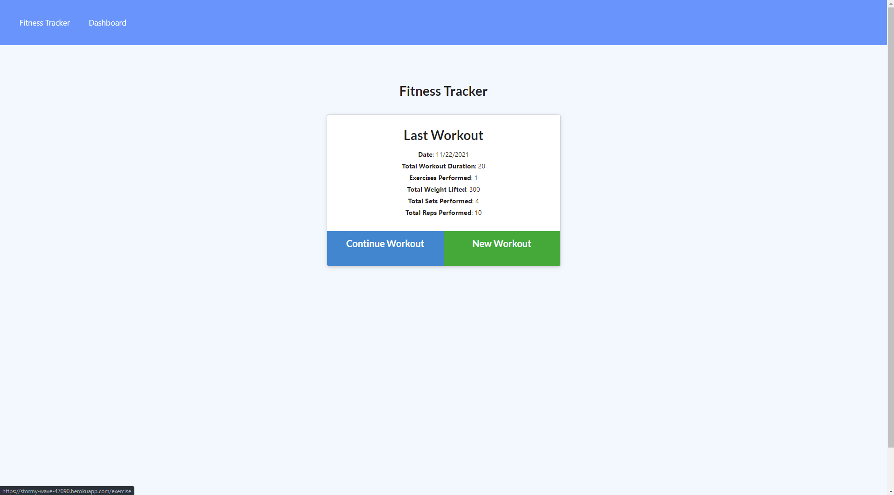
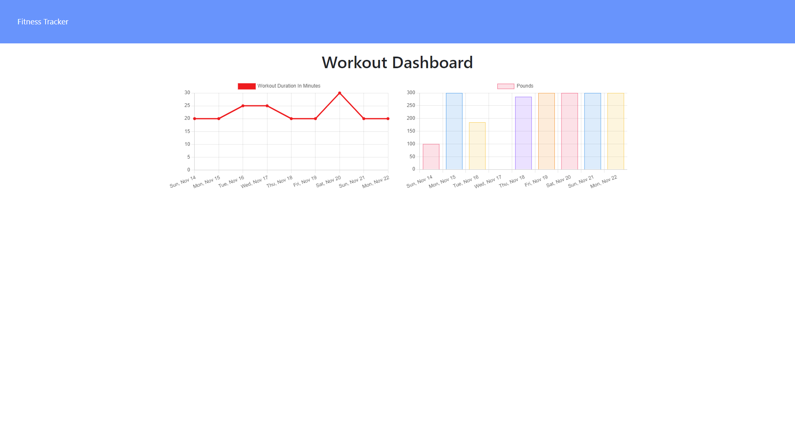

# Fitness_Tracker
  [](https://opensource.org/licenses/MIT)

  

  


  ## Description:
  This is a fitness tracker app that allows you to log and continue workouts, as well as track progress.

  ## Deployment:

    https://stormy-wave-47090.herokuapp.com/?id=619d5390797105001691c5fc

    https://github.com/Chris-Franklin-1701/Fitness_Tracker

  ## Installation:
  ``` md git clone to your repo ```
  

  ## Contribution:
  Please contribute to fork

  ## Resources:
  Unit 18, activity 7
  Unit Extensions, number 18
  
  ## License:
  MIT
  https://opensource.org/licenses/MIT

  ## Contact:
  https://christopherfranklin.dev/

  https://github.com/Chris-Franklin-1701
  
  CFrank306@gmail.com

